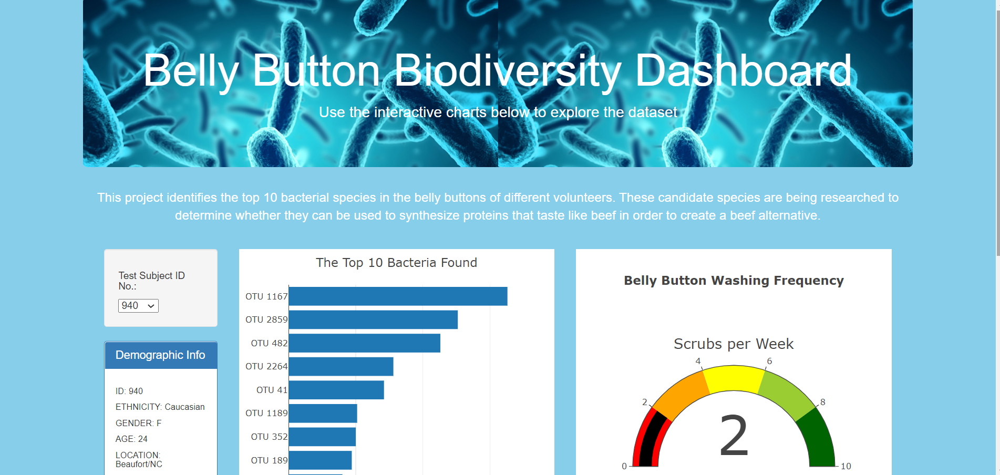
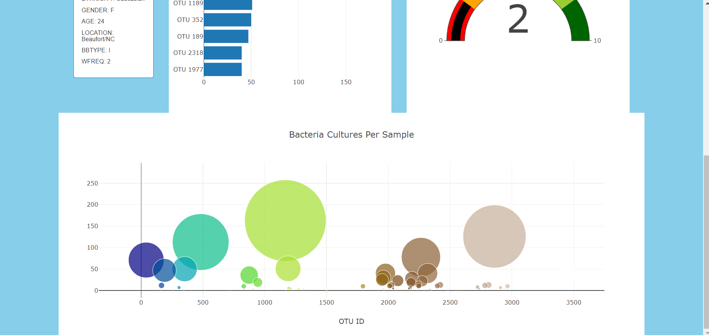

# Belly_Button_Biodiversity

## Overview of Project
This project identifies the top 10 bacterial species in the belly buttons of different volunteers. These candidate species are being researched to determine whether they can be used to synthesize proteins that taste like beef in order to create a beef alternative.

